# 🏢 Employee Leave Management System

<p align="center">
  <b>A Full-Stack Employee Leave Management System built with React, FastAPI, PostgreSQL and AWS</b>
</p>

<p align="center">
  
  
  
  
  
</p>

---

## 🌟 Project Overview

The **Employee Leave Management System** is a full-stack web application designed to digitize employee leave operations through separate **Employee** and **Manager** workflows.

Employees can securely log in, view their profile and leave balance, apply for leave, track request status, and upload documents. Managers can review employee requests, approve or reject leave applications, and add comments.

The application is deployed on AWS using a custom VPC, public/private subnets, an Application Load Balancer, private EC2 backend, private PostgreSQL RDS, Amazon S3, CloudFront, IAM and CloudWatch.

> **Route 53 is intentionally not used.** The frontend is accessed through the CloudFront distribution domain.

---

## 🚀 Live Application

**Frontend:** https://dr363qgupncp7.cloudfront.net/

The production frontend is delivered through **Amazon CloudFront**, with `/api/*` requests routed to the FastAPI backend through an **Application Load Balancer**.

---

## 🎯 Project Objectives

- Build a real-world employee leave management workflow.
- Implement role-based Employee and Manager access.
- Add JWT authentication for protected operations.
- Store application data in PostgreSQL.
- Support leave application, approval and rejection workflows.
- Store employee documents in Amazon S3.
- Deploy the React frontend through CloudFront.
- Host the FastAPI backend on a private EC2 instance.
- Keep the PostgreSQL database private inside the VPC.
- Monitor the deployed environment using Amazon CloudWatch.

---

## ✨ Key Features

### 👤 Employee

- 🔐 Secure login
- 👤 Employee profile
- 📊 Leave balance tracking
- 📝 Leave application
- 📋 Leave request history
- ✅ Approved leave status
- ⏳ Pending leave status
- 🔴 Rejected leave status
- 💬 Manager comments
- 📄 Employee document upload
- 📑 Document listing
- 🔗 Secure document download links

### 👨‍💼 Manager

- 🔐 Manager login
- 📊 Manager dashboard
- 📋 View employee leave requests
- 🔎 Review leave details
- ✅ Approve leave requests
- 🔴 Reject leave requests
- 💬 Add manager comments

---

## 🧩 Technology Stack

### Frontend

- React 19
- Vite
- JavaScript
- HTML5
- CSS3
- Fetch API

### Backend

- Python 3.14+
- FastAPI
- Uvicorn
- SQLAlchemy
- psycopg2
- python-jose (JWT)
- Passlib / Bcrypt
- python-multipart
- python-dotenv
- Boto3

### Database

- PostgreSQL

### AWS

- Amazon VPC
- Public and Private Subnets
- Internet Gateway
- NAT Gateway
- Route Tables
- Security Groups
- Application Load Balancer
- Amazon EC2
- Amazon RDS for PostgreSQL
- Amazon S3
- Amazon CloudFront
- AWS IAM
- Amazon CloudWatch

---

## 🏗️ AWS Architecture

<p align="center">
  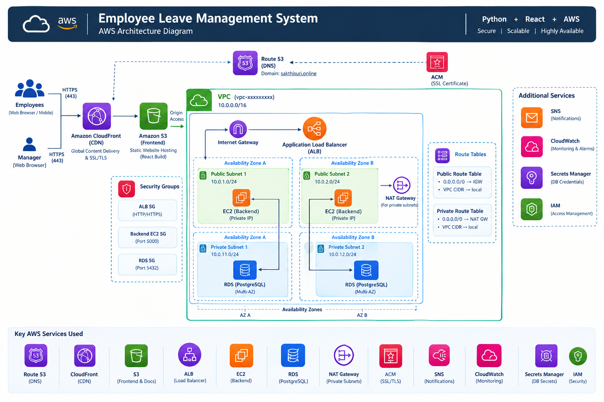
</p>

### 🔄 Request Flow

```text
                         ┌────────────────────┐
                         │    User Browser    │
                         └──────────┬─────────┘
                                    │ HTTPS
                                    ▼
                         ┌─────────────────────┐
                         │   Amazon CloudFront │
                         └───────┬───────┬─────┘
                                 │       │
                         Frontend│       │ /api/*
                                 ▼       ▼
                        ┌────────────┐ ┌──────────────────┐
                        │ Amazon S3  │ │ Application Load │
                        │ React App  │ │ Balancer         │
                        └────────────┘ └────────┬─────────┘
                                                │ HTTP :8000
                                                ▼
                                   ┌─────────────────────────┐
                                   │ Private EC2 Backend     │
                                   │ FastAPI + Uvicorn       │
                                   └───────────┬─────────────┘
                                               │
                              ┌────────────────┴────────────────┐
                              │                                 │
                              ▼                                 ▼
                    ┌──────────────────┐              ┌──────────────────┐
                    │ RDS PostgreSQL   │              │ Amazon S3        │
                    │ Private DB      │              │ Employee Docs   │
                    └──────────────────┘              └──────────────────┘
```

### 🌐 VPC Layout

```text
employee-leave-vpc
10.0.0.0/16
│
├── Public Subnet 1A  → ALB / NAT Gateway
├── Public Subnet 1B  → ALB
├── Private Subnet 1A → Backend EC2
└── Private Subnet 1B → RDS PostgreSQL
```

> The VPC contains public and private subnets across two Availability Zones. The current deployment uses a private EC2 backend instance behind the ALB and a private RDS PostgreSQL database.

---

## ☁️ AWS Services & Responsibilities

| AWS Service | Purpose in this Project |
|---|---|
| **VPC** | Isolated network for the application |
| **Public Subnets** | ALB and NAT Gateway networking |
| **Private Subnets** | Backend EC2 and RDS resources |
| **Internet Gateway** | Internet connectivity for public resources |
| **NAT Gateway** | Outbound internet access for the private subnet |
| **Route Tables** | Control public/private network routing |
| **Security Groups** | Restrict traffic between ALB, EC2 and RDS |
| **Application Load Balancer** | Routes API traffic to the FastAPI backend |
| **EC2** | Hosts the FastAPI application |
| **RDS PostgreSQL** | Stores application data privately |
| **S3** | Stores frontend build files and employee documents |
| **CloudFront** | HTTPS frontend delivery and caching |
| **IAM** | Allows the EC2 role to access required AWS resources |
| **CloudWatch** | Monitors infrastructure metrics and alarms |

---

## 🔐 Security Design

- JWT authentication for application access.
- Backend EC2 is deployed in a **private subnet**.
- RDS PostgreSQL is configured with **Public access = No**.
- ALB accepts public web traffic and forwards API requests to the backend.
- Backend Security Group allows TCP `8000` from the ALB Security Group.
- RDS Security Group allows PostgreSQL `5432` from the backend Security Group.
- EC2 uses an IAM role for S3 access instead of hard-coded AWS access keys.
- Employee documents are stored in S3 and downloaded through application-generated presigned URLs.
- CloudFront provides HTTPS access to the production frontend.

---

## 🗄️ Database Design

The PostgreSQL database contains the following core tables:

| Table | Purpose |
|---|---|
| `users` | Login accounts, password hashes and roles |
| `departments` | Department master data |
| `employees` | Employee information |
| `leave_types` | Leave categories and default days |
| `leave_balances` | Employee leave balances |
| `leave_requests` | Leave applications and approval status |
| `documents` | Employee document metadata and S3 keys |
| `audit_logs` | Application activity records |

### 🔗 Main Relationships

```text
users
  │
  └── employees
       │
       ├── leave_balances ─── leave_types
       │
       ├── leave_requests ─── leave_types
       │
       └── documents
```

---

## 🔐 Authentication & Authorization

JWT-based authentication is implemented in the FastAPI backend.

```text
Login
  │
  ▼
Credentials validated by FastAPI
  │
  ▼
JWT token generated
  │
  ▼
Frontend sends authenticated API requests
  │
  ▼
Authorization: Bearer <token>
```

### Roles

- `EMPLOYEE`
- `MANAGER`

Manager authorization is required for leave approval and rejection operations.

---

## 🔌 REST API

### Authentication

| Method | Endpoint | Description |
|---|---|---|
| `POST` | `/api/auth/register` | Register a user |
| `POST` | `/api/auth/login` | Authenticate a user |

### Employees

| Method | Endpoint | Description |
|---|---|---|
| `GET` | `/api/employees` | List employees |
| `GET` | `/api/employees/{id}` | Get employee details |

### Leave Management

| Method | Endpoint | Description |
|---|---|---|
| `POST` | `/api/leaves` | Create leave request |
| `GET` | `/api/leaves` | List leave requests |
| `GET` | `/api/leaves/{id}` | Get a leave request |
| `PUT` | `/api/leaves/{id}/approve` | Approve a request |
| `PUT` | `/api/leaves/{id}/reject` | Reject a request |

### Documents

| Method | Endpoint | Description |
|---|---|---|
| `POST` | `/api/documents/upload` | Upload document to S3 |
| `GET` | `/api/documents/{employee_id}` | List employee documents |
| `GET` | `/api/documents/download/{document_id}` | Generate a presigned download URL |

### Dashboard

| Method | Endpoint | Description |
|---|---|---|
| `GET` | `/api/dashboard` | Retrieve dashboard information |

### 📚 API Documentation

FastAPI automatically provides Swagger UI at:

```text
http://localhost:8000/docs
```

---

## 📁 Project Structure

```text
employee-leave-management/
│
├── backend/
│   ├── app/
│   │   ├── __init__.py
│   │   ├── main.py
│   │   ├── database.py
│   │   ├── models.py
│   │   ├── schemas.py
│   │   ├── auth.py
│   │   └── routers/
│   │       ├── __init__.py
│   │       ├── auth.py
│   │       ├── employees.py
│   │       ├── leaves.py
│   │       └── documents.py
│   │
│   ├── requirements.txt
│   └── .env
│
├── frontend/
│   ├── src/
│   │   ├── App.jsx
│   │   ├── App.css
│   │   ├── index.css
│   │   └── main.jsx
│   ├── package.json
│   └── vite.config.js
│
├── architecture/
│   ├── architecture-diagram.png
│  
│
├── screenshots/
│   ├── 01_Employee_Dashboard.png
│   ├── 02_Manager_Dashboard.png
│   ├── 03_Leave_Requests.png
│   ├── 04_Leave_Approval.png
│   ├── 05_Leave_Rejection.png
│   ├── 06_Document_Management.png
│   ├── 07_CloudWatch_Monitoring.png
│   ├── 08_AWS_Architecture_Diagram.png
│   ├── 09_VPC_Details.png
│   ├── 10_Subnets_Route_Tables.png
│   ├── 11_NAT_IGW.png
│   ├── 12_Security_Groups.png
│   ├── 13_EC2_Backend.png
│   ├── 14_ALB_Target_Group.png
│   ├── 15_RDS_PostgreSQL.png
│   └── 16_S3_CloudFront.png
│
└── README.md
```

> Do not commit real passwords, AWS access keys, database credentials or other secret values. Keep real `.env` values outside GitHub.

---

## 💻 Local Development

### Prerequisites

- Python 3.14+
- Node.js and npm
- PostgreSQL 17+
- Git
- AWS CLI
- Visual Studio Code

### 1. Clone the Repository

```bash
git clone <YOUR_GITHUB_REPOSITORY_URL>
cd employee-leave-management
```

### 2. Backend Setup

```powershell
cd backend
py -3.14 -m venv venv
.\venv\Scripts\Activate.ps1
pip install -r requirements.txt
```

Create a `.env` file with your own local/deployment values:

```env
DATABASE_URL=postgresql+psycopg2://<username>:<password>@<host>:5432/<database>
AWS_REGION=ap-south-1
S3_BUCKET_NAME=<document-bucket-name>
SECRET_KEY=<strong-secret-key>
```

Start the backend:

```powershell
uvicorn app.main:app --reload
```

Backend:

```text
http://localhost:8000
```

Swagger:

```text
http://localhost:8000/docs
```

### 3. Frontend Setup

```powershell
cd frontend
npm install
npm run dev
```

Frontend:

```text
http://127.0.0.1:5173/
```

---

## 🚀 AWS Deployment

### Backend Deployment Flow

```text
Custom VPC
   │
   ├── Public Subnets
   │     ├── Application Load Balancer
   │     └── NAT Gateway
   │
   └── Private Subnets
         ├── EC2 FastAPI Backend
         └── RDS PostgreSQL
```

The backend runs as a Linux systemd service using Uvicorn on port `8000`.

### Frontend Deployment Flow

```text
React + Vite
     │
     ▼
npm run build
     │
     ▼
Amazon S3
     │
     ▼
Amazon CloudFront
     │
     ▼
HTTPS User Access
```

### Build and Upload Frontend

```powershell
npm run build
aws s3 sync dist s3://<frontend-bucket-name> --delete
```

### CloudFront Cache Invalidation

```powershell
aws cloudfront create-invalidation --distribution-id <distribution-id> --paths "/*"
```

---

## 📄 Document Management Flow

```text
Employee selects file
        │
        ▼
FastAPI upload endpoint
        │
        ▼
Amazon S3
        │
        ├── Object stored in employee-specific key path
        │
        ▼
Document metadata saved in PostgreSQL
        │
        ▼
Presigned download URL generated by backend
```

---

## 🔄 Application Workflow

### Employee Workflow

```text
Login
  │
  ▼
Employee Dashboard
  │
  ├── Profile
  ├── Leave Balance
  ├── Apply Leave
  ├── Leave History
  └── Documents
```

### Manager Workflow

```text
Login
  │
  ▼
Manager Dashboard
  │
  ▼
View Leave Requests
  │
  ├── Approve
  └── Reject
```

---

## 📸 Screenshots

### 👤 Employee Dashboard

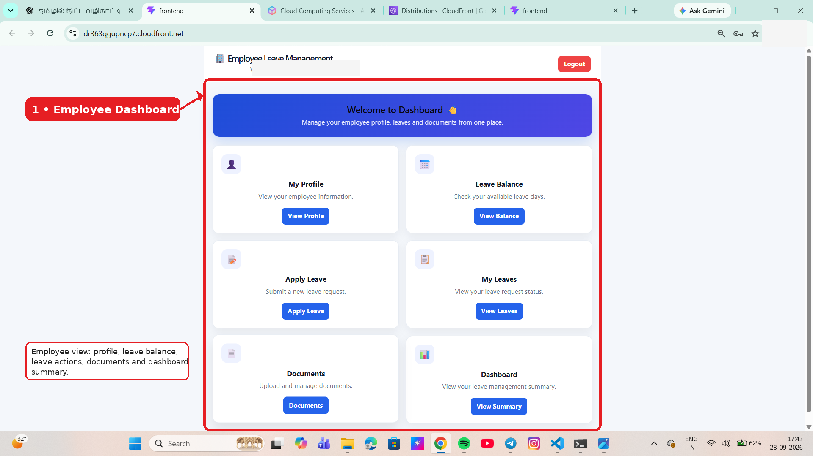

### 👨‍💼 Manager Dashboard

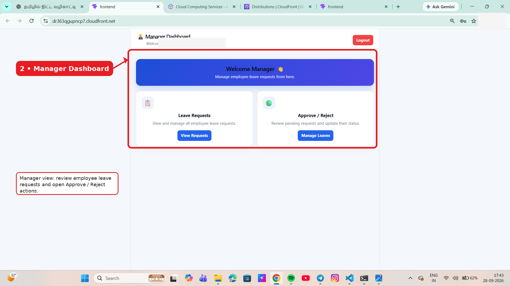

### 📋 Leave Requests

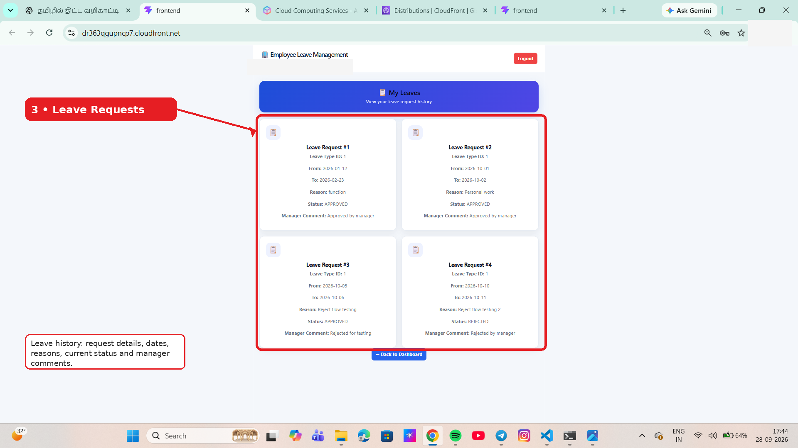

### ✅ Leave Approval

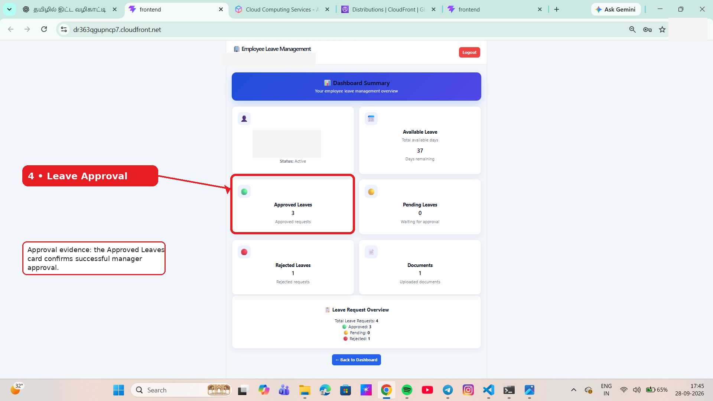

### 🔴 Leave Rejection

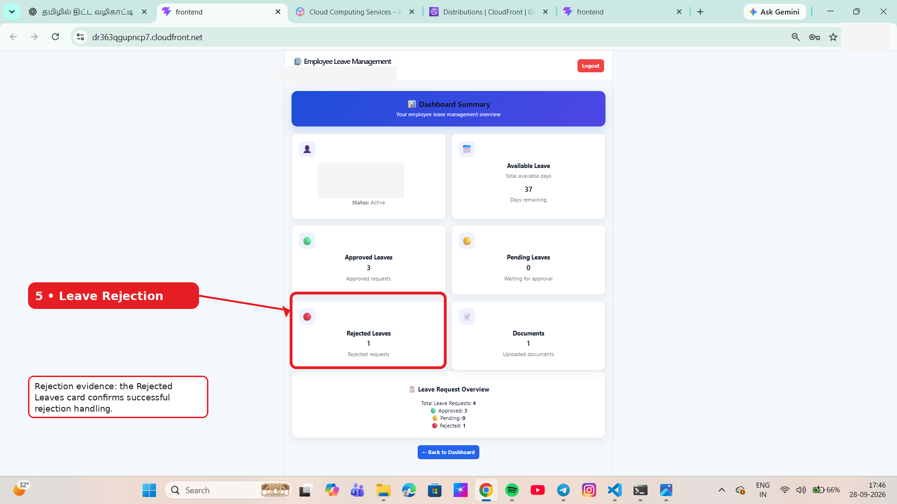

### 📄 Document Management

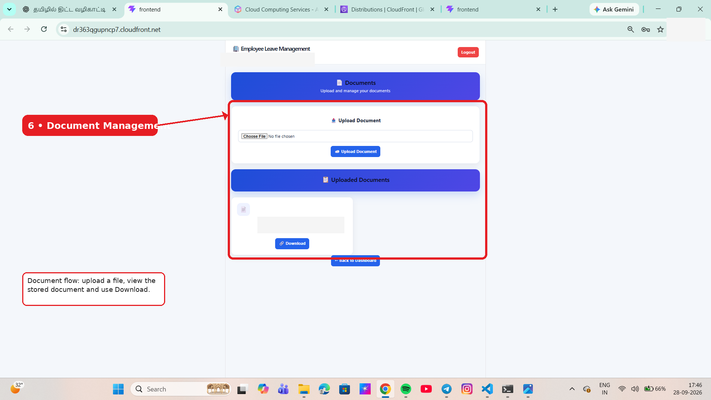

### 📊 CloudWatch Monitoring

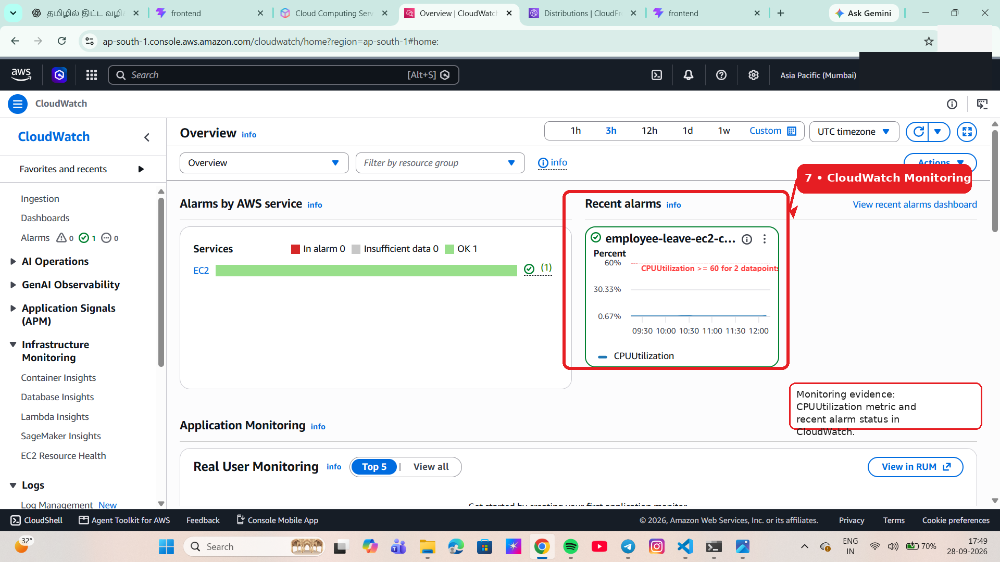

### 🏗️ AWS Architecture Diagram


### 🌐 VPC Details

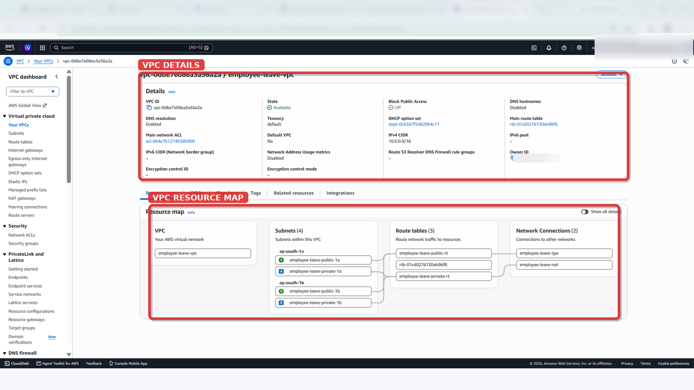

### 🔗 Subnets + Route Tables

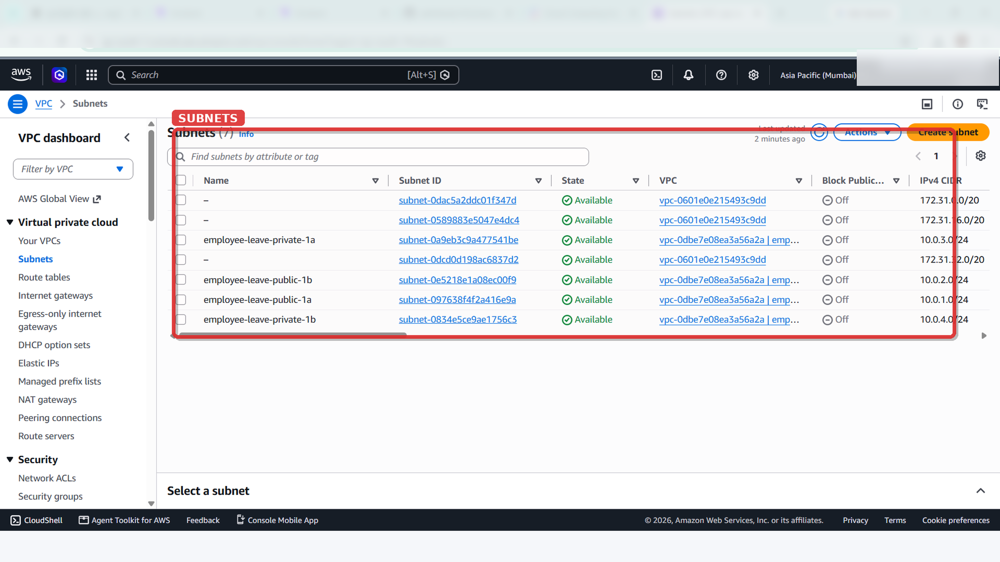

### 🚪 NAT Gateway + Internet Gateway

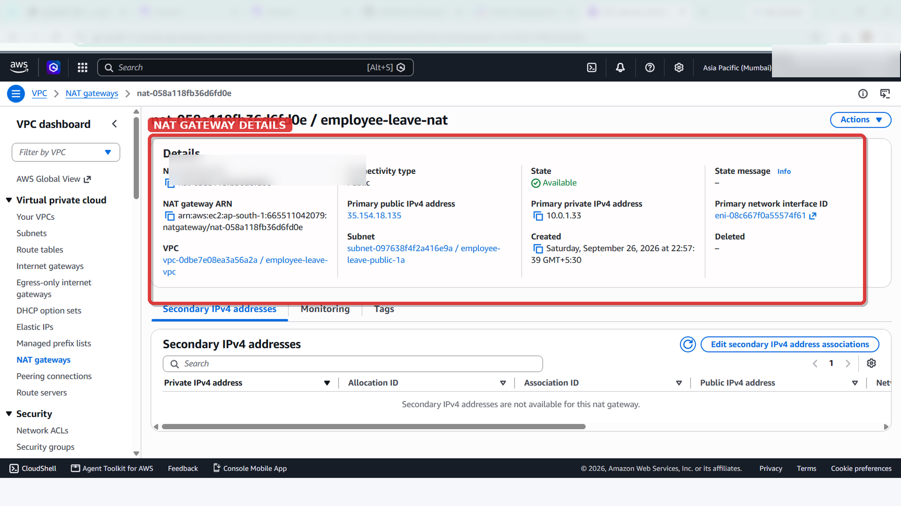

### 🛡️ Security Groups

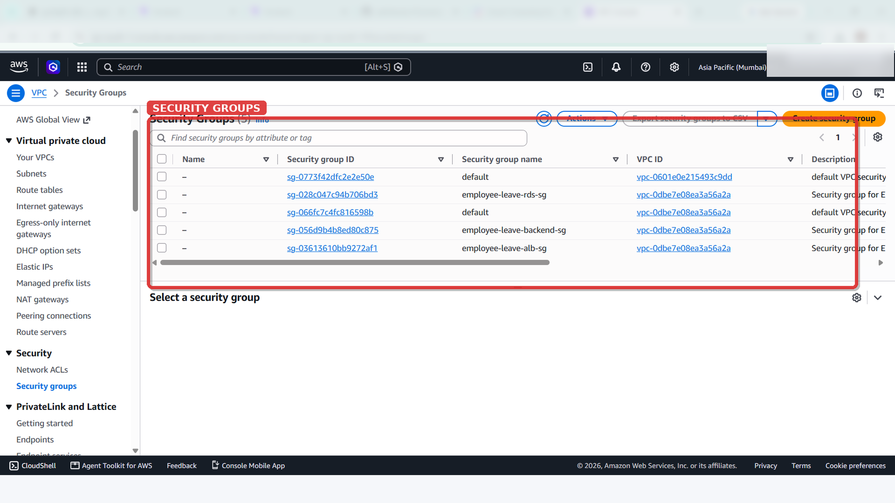

### 🖥️ EC2 Backend Instance

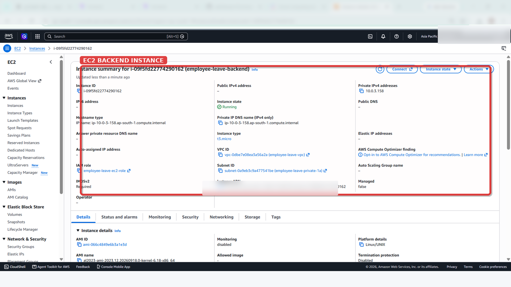

### ⚖️ ALB + Target Group — Healthy

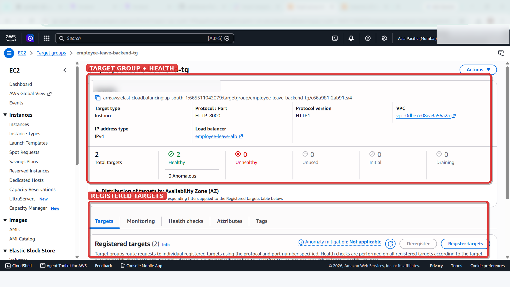

### 🗄️ RDS PostgreSQL — Public Access No

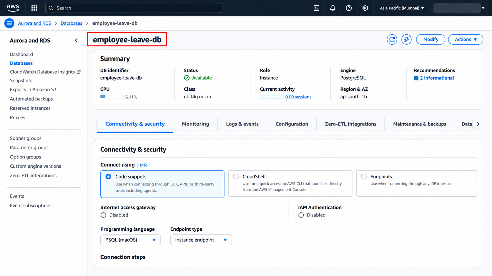

### ☁️ S3 + CloudFront

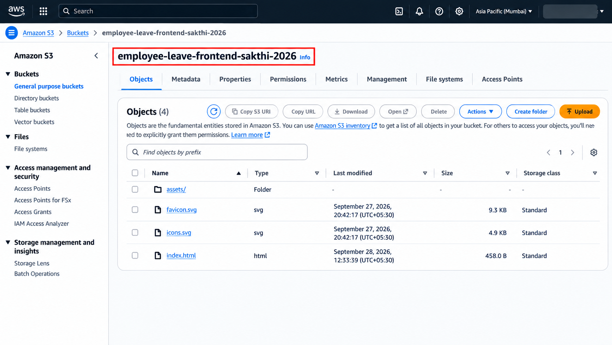

---

## ✅ Testing & Validation

The deployed application was tested end-to-end for the main user and AWS workflows.

| Test | Result |
|---|---|
| Employee login | ✅ Passed |
| Manager login | ✅ Passed |
| Employee dashboard | ✅ Passed |
| Leave request submission | ✅ Passed |
| Manager approval | ✅ Passed |
| Manager rejection | ✅ Passed |
| Leave status tracking | ✅ Passed |
| S3 document upload | ✅ Passed |
| Document listing | ✅ Passed |
| Document download | ✅ Passed |
| ALB health check | ✅ Healthy |
| EC2 → RDS connectivity | ✅ Verified |
| CloudFront frontend access | ✅ Passed |
| CloudWatch monitoring | ✅ Verified |

---

## 📈 Monitoring

Amazon CloudWatch is used to monitor the deployed backend environment.

Current monitoring evidence includes:

- EC2 CPU utilization
- CloudWatch alarm status
- Recent monitoring data

This helps observe infrastructure resource usage and provides visibility into the deployed environment.

---

## 🌟 Project Highlights

- ✅ React 19 + Vite frontend
- ✅ Python FastAPI backend
- ✅ PostgreSQL database
- ✅ JWT authentication
- ✅ Employee and Manager roles
- ✅ Leave application workflow
- ✅ Approval and rejection workflow
- ✅ S3 document management
- ✅ Private EC2 backend
- ✅ Private RDS PostgreSQL
- ✅ Application Load Balancer
- ✅ VPC with public/private subnet architecture
- ✅ NAT Gateway and Internet Gateway
- ✅ IAM-controlled S3 access
- ✅ CloudFront frontend delivery
- ✅ CloudWatch monitoring
- ✅ End-to-end production testing
- ✅ No Route 53 dependency

---

## 🎓 Learning Outcomes

This project provided hands-on experience with:

`React` · `FastAPI` · `Python` · `PostgreSQL` · `JWT` · `AWS VPC` · `Subnets` · `Route Tables` · `Security Groups` · `NAT Gateway` · `Internet Gateway` · `EC2` · `ALB` · `RDS` · `S3` · `CloudFront` · `IAM` · `CloudWatch` · `Git` · `GitHub`

---

## 💰 AWS Cost Awareness

AWS resources can incur charges depending on configuration and usage. For a learning environment, review resources after testing and stop or delete resources that are no longer required.

Pay particular attention to:

- NAT Gateway
- RDS
- EC2
- Application Load Balancer
- CloudFront
- S3

---

## 👨‍💻 Author

**Sakthivel P**  
**BCA Graduate | AWS & Networking Fresher**

### Skills

`AWS` · `Networking` · `Python` · `FastAPI` · `React` · `PostgreSQL` · `Docker` · `Git` · `GitHub`

---

## 📌 Project Summary

> **Employee Leave Management System** is an end-to-end cloud project combining full-stack development, JWT authentication, PostgreSQL database design, AWS networking, private infrastructure, S3 document storage, CloudFront delivery, IAM permissions and CloudWatch monitoring.

---

<p align="center">
  <b>🚀 Built with Python + React + PostgreSQL + AWS</b>
</p>

<p align="center">
  <i>Employee Leave Management System</i>
</p>
